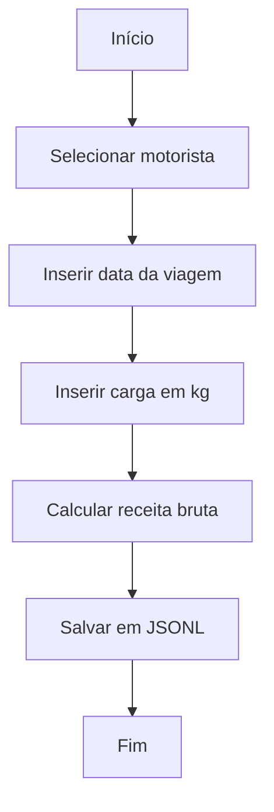
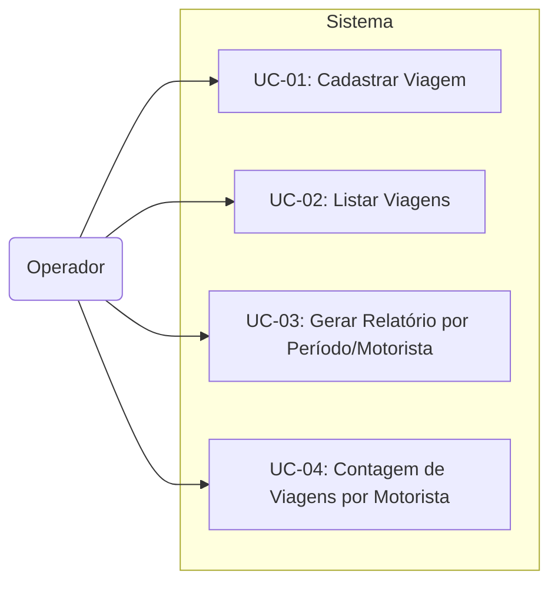
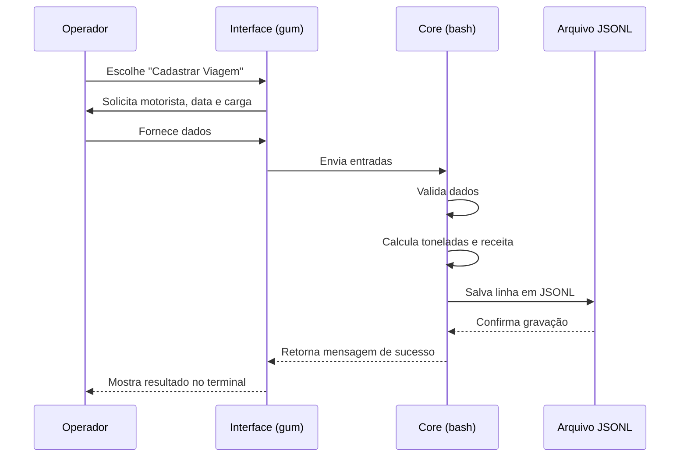
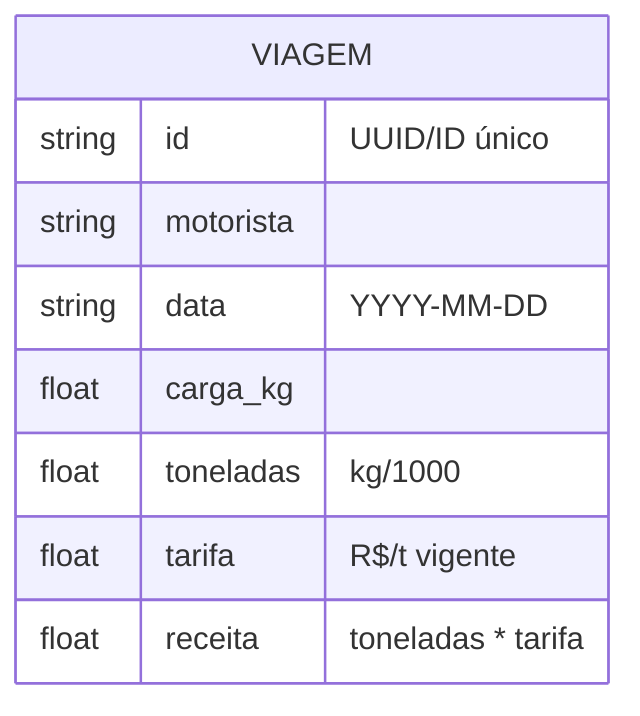

# Especificação de requisitos de software

## 1. Introdução

### 1.1 Propósito

O propósito deste sistema é registrar e organizar as viagens realizadas pelos conjuntos, armazenando informações de motorista, carga e data, para apoiar o controle logístico e facilitar análises operacionais.

### 1.2 Escopo

O sistema terá como escopo:

- Registrar viagens com informações de motorista, data, peso transportado e valor correspondente
- Permitir consulta e acompanhamento das viagens registradas
- Calcular a receita bruta por viagem e exibir resultados em relatórios simples (por período e motorista)

Fora do escopo do sistema:

- Rastreamento em tempo real via GPS
- Integração automática com sistemas fiscais ou de pedágios
- Gestão de manutenção de frota

### 1.3 Definições, Acrônimos e Abreviações

- **Conjunto**: cavalo mecânico (caminhão) acoplado a um ou mais reboques (carretas)
- **Viagem**: deslocamento do conjunto de um ponto de origem (carregamento) a um ponto de destino (descarga), registrada como uma unidade de transporte no sistema
- **Motorista**: responsável pela condução do conjunto
- **Tarifa**: valor fixo em reais (BRL) aplicado por tonelada transportada
- **Receita Bruta**: valor total calculado pela multiplicação da quantidade de toneladas transportadas pela tarifa vigente, sem considerar deduções de custos
- **Carga (kg)**: peso do material transportado em quilogramas
- **Tonelada (t)**: unidade equivalente a 1.000 kg, utilizada como base para cálculo da tarifa e da receita bruta

## 2. Descrição Geral

### 2.1 Perspectiva do Produto

O sistema é um produto independente, destinado a substituir o uso de planilhas em Excel e anotações em papel para controle de viagens. Funciona de forma local-first, sem integração com sistemas externos, e é voltado para pequenas operações de transporte rodoviário (1 a 10 conjuntos).

### 2.2 Funções do Produto

- Registrar viagens com informações de motorista, data e carga em quilogramas
- Calcular a receita bruta de cada viagem
- Permitir consulta das viagens registradas
- Gerar contagem e relatórios simples de viagens por motorista e por período

### 2.3 Características dos Usuários

O software é voltado para gestores de frotas de pequeno porte (1 a 10 conjuntos), com baixa instrução técnica em computação. A interação ocorre por meio de interface em linha de comando (CLI), com menus de texto simples.

### 2.4 Restrições

- O software não terá Interface Gráfica (GUI), operando exclusivamente via terminal
- A profundidade dos dados é limitada, impossibilitando relatórios complexos
- O armazenamento será feito em arquivo local no formato JSONL
- Não há suporte a múltiplos usuários simultâneos ou rede

### 2.5 Suposições e Dependências

- A tarifa estará sempre definida no arquivo `config.sh` sob a variável `TARIFF`
- Dados como carga e data serão inseridos corretamente pelos usuários, sujeitos apenas a validações básicas de formato
- O funcionamento requer as ferramentas `gum`, `date` e `bc`
- Os motoristas estarão previamente cadastrados no arquivo `config.sh`

## 3. Requisitos Específicos

### 3.1 Requisitos Funcionais

- **RF-01**: O sistema deve permitir o registro de viagens com informações de motorista, data e carga em quilogramas
- **RF-02**: O sistema deve calcular a receita bruta de cada viagem a partir da carga em toneladas multiplicada pela tarifa vigente
- **RF-03**: O sistema deve armazenar cada viagem como uma linha em formato JSONL
- **RF-04**: O sistema deve permitir listar todas as viagens registradas em formato de tabela no terminal
- **RF-05**: O sistema deve permitir gerar relatórios simples por período e por motorista
- **RF-06**: O sistema deve apresentar o número total de viagens por motorista nos relatórios gerados

### 3.2 Requisitos Não Funcionais

- **RNF-01**: O sistema deve ser implementado em shell script (bash 4+)
- **RNF-02**: O sistema deve operar exclusivamente em linha de comando, sem interface gráfica
- **RNF-03**: O sistema deve utilizar arquivos locais no formato JSONL como base de dados
- **RNF-04**: O sistema deve funcionar em ambiente Linux com as dependências `gum`, `jq`, `date` e `bc`
- **RNF-05**: O sistema deve suportar até 50.000 registros de viagens, mantendo tempo de resposta inferior a 3 segundos em consultas e listagens
- **RNF-06**: O sistema deve apresentar mensagens de erro claras quando houver dados inválidos

### 3.3 Restrições de Design

- **RSD-01**: A tarifa será definida como constante no arquivo `config.sh`, e cada viagem registrada deve gravar a tarifa vigente no momento do cadastro
- **RSD-02**: O sistema não terá suporte a múltiplos usuários simultâneos
- **RSD-03**: O armazenamento dos dados será feito em arquivo local, sem integração a bancos de dados externos

### 3.4 Atributos de Qualidade

- **Usabilidade**: interface em linha de comando simples, baseada em menus de texto
- **Portabilidade**: deve funcionar em distribuições Linux sem necessidade de softwares proprietários
- **Manutenibilidade**: código modular, separado em arquivos de configuração, bibliotecas e módulos de negócio
- **Confiabilidade**: registros devem ser gravados imediatamente em arquivo JSONL e não podem ser sobrescritos retroativamente pelo sistema

## 4. Modelos e Diagramas

### 4.1 Fluxo de Cadastro de Viagem

### 4.2 Diagrama de Casos de Uso

### 4.3 Sequência de Operações

### 4.4 Modelo de Dados

